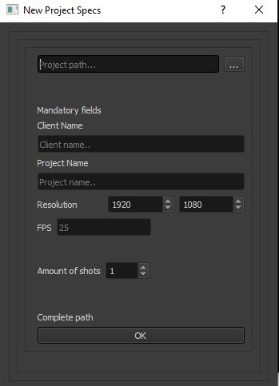
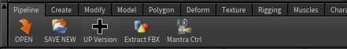

## Simple pipeline and Houdini Python tools

Hi!!

I am learning Python on my free time, and to do it I decided to 
create some simple tools that should help me speed up my workflow and
scene creation inside Houdini, doing things like enforcing name convention, 
setting and loading tools at running time, create all the needed Environment variables,
store information of the shots inside Json files so then I can query information or create
a database, and hopefully with time I will be able to
integrate more softwares like Nuke, Maya and PFtrack.

The scripts might not be elegant and this is because I am fairly new to the 
language, and for now they are not very software Agnostic, the more I learn
the more I realize that I should be splitting and encapsulating things in a
smarter way, but with time they will get better.

For this to work you need two folders in your C drive:

C:/_pipeline

C:/_fxProjects

Clone this repository into the _pipeline folder, also make sure that inside _pipeline/python/apps_path.py you set the 
path to your Houdini version.

All the projects and metadata will be created in _fxProjects and all the pipeline tools and scripts will be updated 
inside _pipeline.

### Main elements and Folders:

### _pipeline/python/

All the .py files included here are used to create the project, all the metadata
and the folders related to your project, when you create a project it will create
a json file in the _projects folder containing the information of your project
and also will append the information of your shot to the projects_info_json in 
the _fxProjects folder, this is the ui:

####      Project manager window

####      New Project window

### _pipeline/python/houdini/scripts/python/

All the Python files that will be loaded from Houdini will be included here, inside **file_scripts**
you will find tools to open and create new scenes, increase version, control all the mantra nodes at once
and I will be adding new tools weekly, this are some of them:

####      Pipeline Shelf

####      Open Houdini files Dialog

####      Save Houdini files Dialog

####      Mantra parameters control

